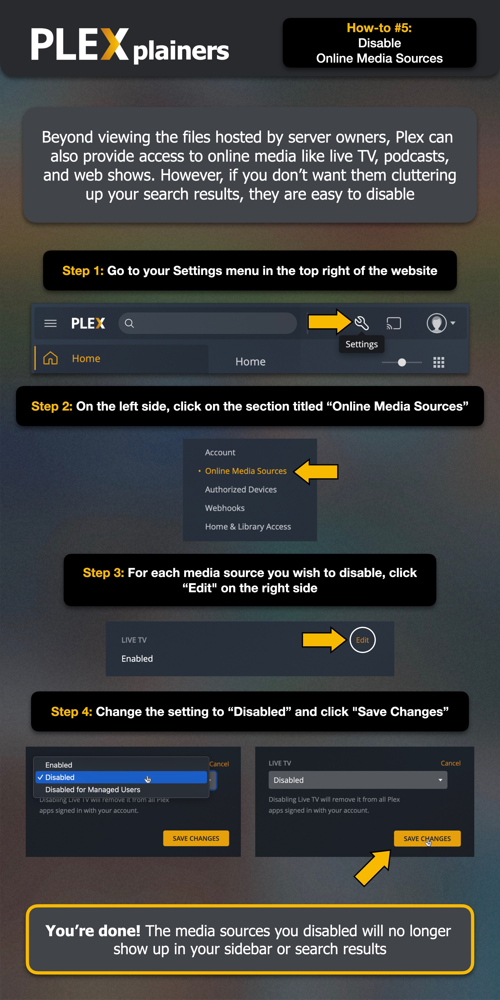

# Deaktivieren von Online-Medienquellen

Plex bietet zusätzliche Dienste wie Live-TV, Musik und Web-Shows, die  möglicherweise in deiner Seitenleiste sehen. Wenn Du nur auf meine Film- und Fernsehserien-Bibliotheken zugreifen möchtest, kannst du diese zusätzlichen Dienste deaktivieren oder aus der Seitenleiste entfernen, um die Benutzeroberfläche übersichtlich und fokussiert zu halten. Dies kann über die Einstellungen der Plex-Anwendung erfolgen und hilft, Verwechslungen zwischen meinen Inhalten und den Online-Diensten von Plex zu vermeiden.

!!! example "How-to: Deaktivieren von Online-Medienquellen"

    

    **Source**: [plxplainers.xyz](https://www.plxplainers.xyz/)
