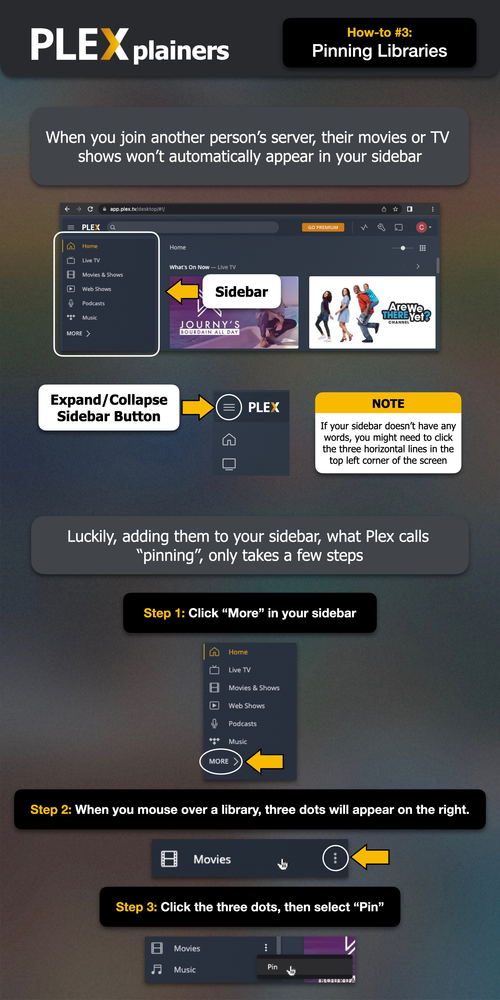
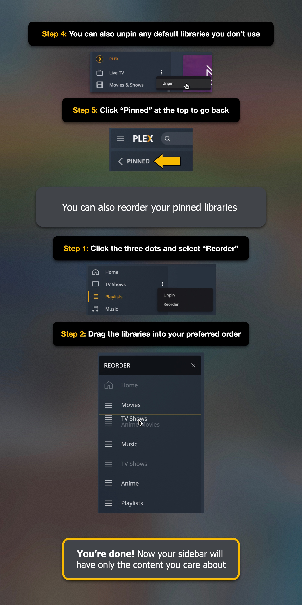

# Bibliotheken anheften

Nachdem Du meine Einladung zu meinem Plex‑Server angenommen hast, musst Du die freigegebenen Bibliotheken an Deine Seitenleiste anheften. Das ist ein notwendiger Schritt – sonst siehst Du eventuell nur die Standardinhalte von Plex statt meiner Mediensammlung. Hier ist, was du tun musst:

1.	Suche in Deinen Medienquellen nach „plexdazzah“.
2.	Du solltest die folgenden Bibliotheken sehen: Movies, Movies (Kids), TV
3.	Hefte diese Bibliotheken an Deine Seitenleiste.

**Empfohlen:** Löse die Standardbibliotheken von Plex, damit Dein Startbildschirm auf meine Inhalte fokussiert bleibt. Das ist besonders hilfreich, weil Plex seit 2025 immer stärker eigene Inhalte bewirbt.

!!! tip ""
    Wenn Dir während des Ansehens Werbung angezeigt wird, stammt sie von Plex – nicht von mir. Mein Server zeigt grundsätzlich keine Werbung an.

!!! example "How-to: Bibliotheken anheften"

    
    
