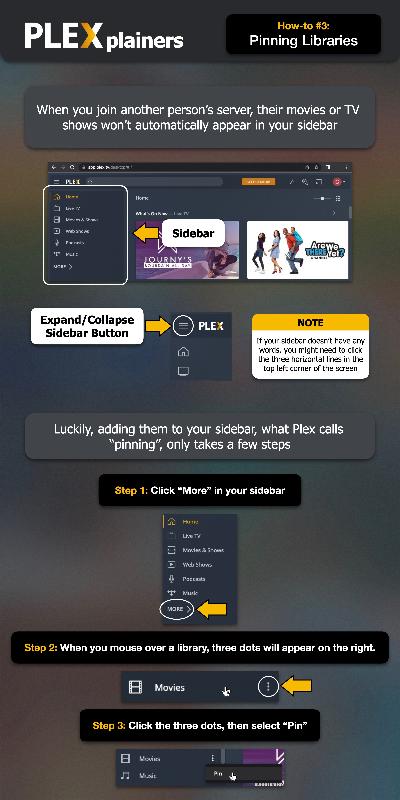
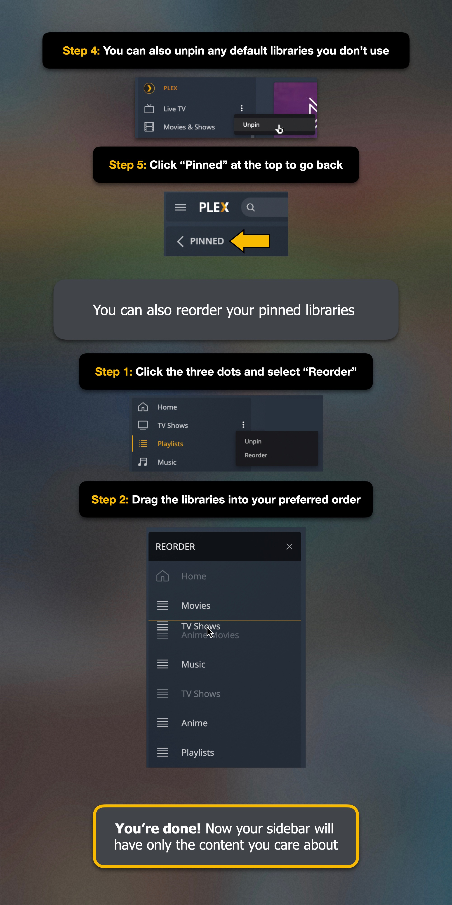

# Bibliotheken anheften

Nachdem du die Einladung zu meinem Plex‑Server angenommen hast, musst du die freigegebenen Bibliotheken an deine Seitenleiste anheften. Das ist ein notwendiger Schritt – sonst siehst du eventuell nur die Inhalte von Plex.

1.	Suche nach meiner Medienquelle.
2.	Du solltest die folgenden Bibliotheken sehen: Movies, Movies (Kids), TV
3.	Hefte diese Bibliotheken an deine Seitenleiste.

!!! tip
    Löse die Standardbibliotheken von Plex, damit dein Startbildschirm auf meine Inhalte fokussiert bleibt. Das ist besonders hilfreich, weil Plex seit 2025 immer stärker eigene Inhalte bewirbt.

!!! info
    Wenn dir Werbung angezeigt wird, stammt sie von Plex – nicht von mir. Mein Server zeigt grundsätzlich keine Werbung an!

??? example "Foto-Guide: Bibliotheken anheften"

    
    
