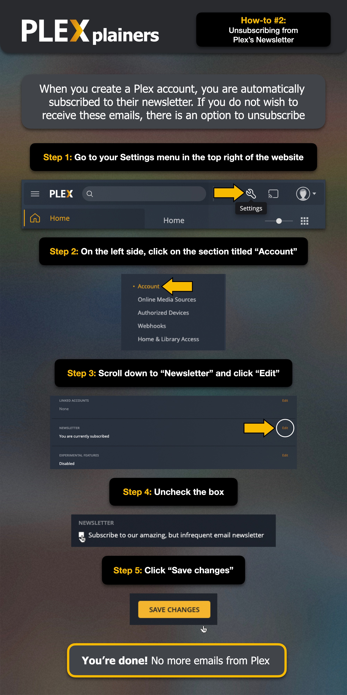

# Newsletter-Abonnements verwalten
Neue Plex-Konten werden automatisch für den Unternehmens-Newsletter von Plex angemeldet. Dies wird direkt von Plex verwaltet und unterliegt nicht der Kontrolle meines Servers. Du kannst Dich über Deine Plex-Kontoeinstellungen davon abmelden.

??? example "Foto-Guide: Newsletter-Abonnements verwalten"

    
