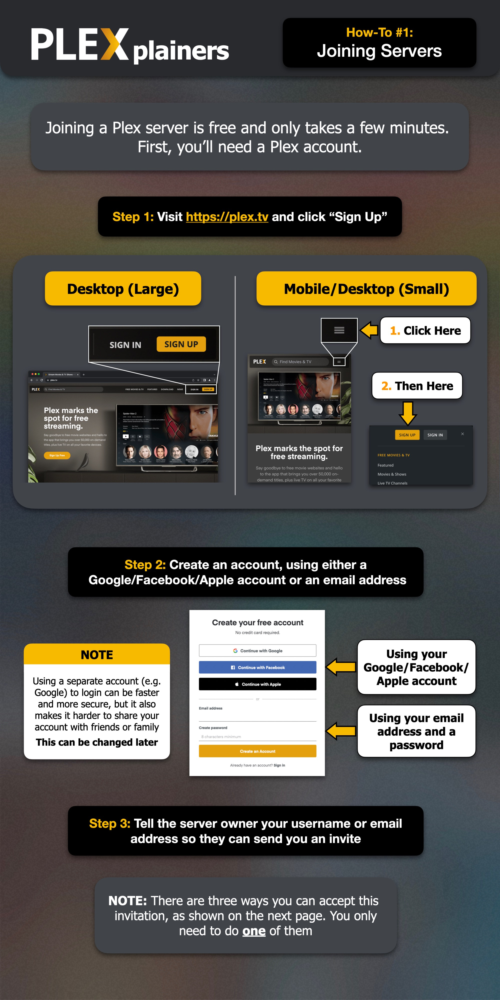
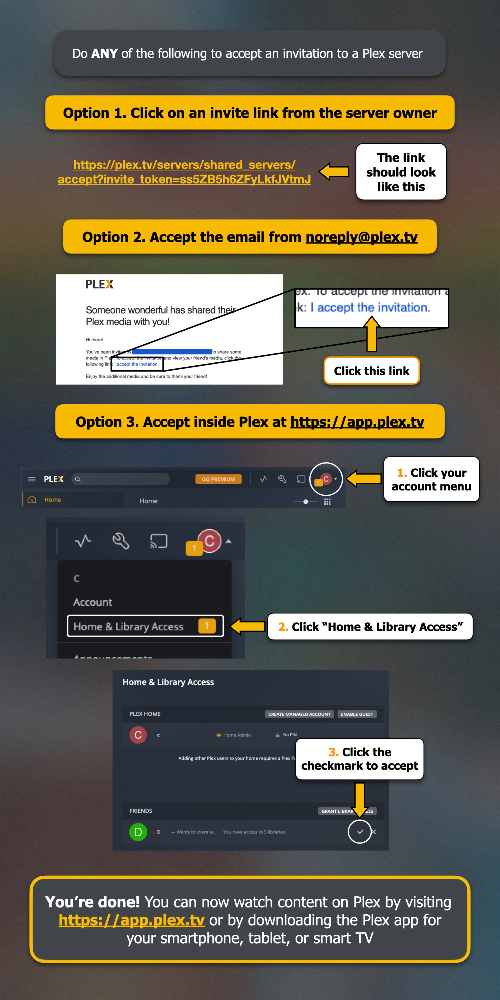

# Was ist Plex?
Plex ist eine legale und kostenlose Medien-Streaming-Plattform, die Deinen Computer oder Dein Smartphone in einen persönlichen „Netflix‑ähnlichen“ Dienst verwandelt. Wenn Plex auf einem Server installiert ist, schafft sie eine Benutzeroberfläche, über die Du Filme und TV-Serien von jedem Gerät aus ansehen kannst – egal ob zu Hause oder unterwegs.

Wenn Du Dich mit meinem Plex-Server verbindest, bekommst Du Zugriff auf meine Medienbibliothek, ohne selbst einen Server einrichten oder warten zu müssen. Du brauchst dafür lediglich ein Plex-Konto. Ein Plex Pass ist nicht erforderlich.

??? example "Foto-Guide: Dem Plex-Server beitreten"

    
    

!!! info 
    Während die Plex-Apps kostenlos sind, fällt für die mobilen Apps eine einmalige Aktivierungsgebühr von 5 € an. Diese Zahlung erfolgt direkt über die App. Wenn Du die App auf einem iOS-Gerät freischaltest, wird damit automatisch die Nutzung auf allen iOS-Geräten aktiviert, die mit Deinem Konto verbunden sind. Aktivierst Du die App auf einem Android-Gerät, gilt die Freischaltung ebenso für alle Android-Geräte in Deinem Konto.

Für weitere Information, schau Dir am besten die offizielle Webseite an: [plex.tv](https://www.plex.tv/)
