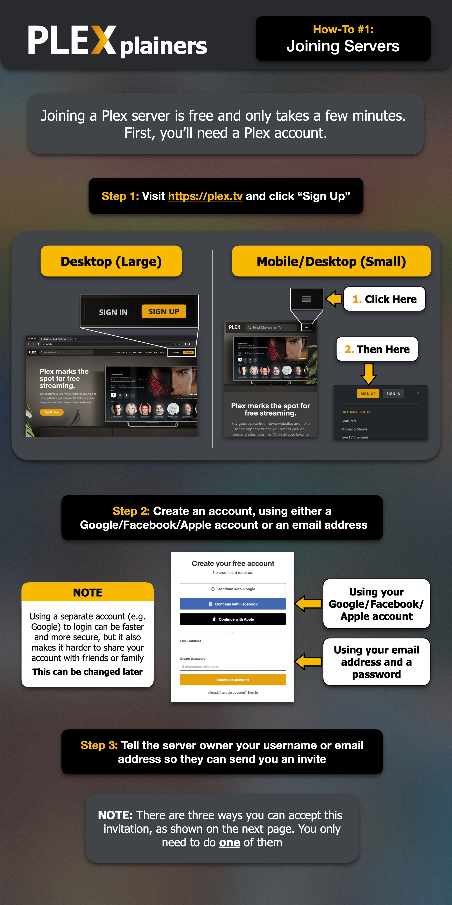
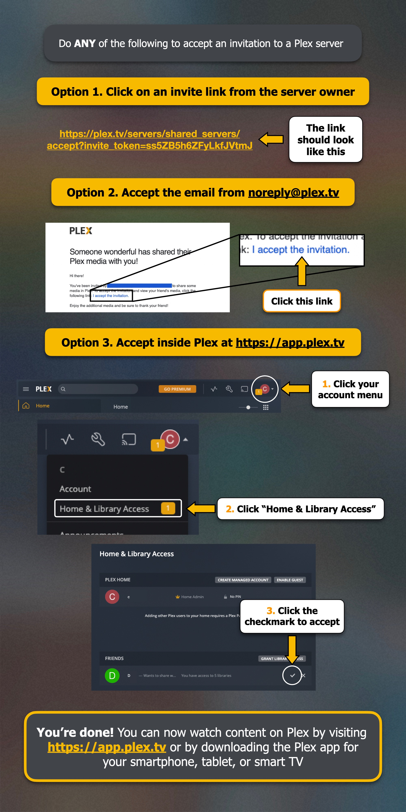

# Was ist Plex?

Plex ist eine legale und kostenlose Medien-Streaming-Plattform, die deinen Computer oder dein Smartphone in einen persönlichen „Netflix‑ähnlichen“ Dienst verwandelt. Wenn Plex auf einem Server installiert ist, schafft sie eine Benutzeroberfläche, über die du Filme und TV-Serien von jedem Gerät aus ansehen kannst – egal ob zu Hause oder unterwegs.

Wenn du dich mit meinem Plex-Server verbindest, bekommst du Zugriff auf meine Medienbibliotheken, ohne selbst einen Server einrichten oder warten zu müssen. Du brauchst dafür lediglich ein [Plex-Konto](https://www.plex.tv/sign-up/). Ein Plex Pass ist nicht erforderlich!

??? example "Foto-Guide: Dem Plex-Server beitreten"

    
    

!!! info 
    Während die Plex-Apps kostenlos sind, fällt für die mobilen Apps eine einmalige Aktivierungsgebühr von 5 € an. Diese Zahlung erfolgt direkt über die App. Wenn du die App auf einem iOS-Gerät freischaltest, wird damit automatisch die Nutzung auf allen iOS-Geräten aktiviert, die mit deinem Konto verbunden sind. Aktivierst du die App auf einem Android-Gerät, gilt die Freischaltung ebenso für alle Android-Geräte in deinem Konto.

Für weitere Information, schaue dir bitte die offizielle Webseite an: [plex.tv](https://www.plex.tv/)
